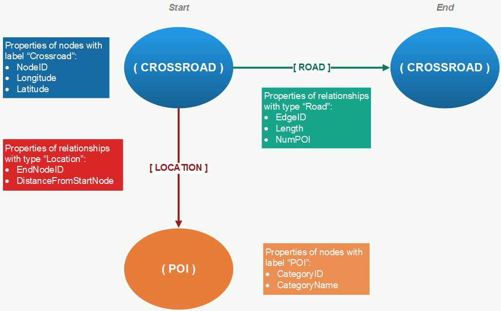

# Graph Mining on California Road Network

## Introduction 
The purpose of thiw project is to model the dataset California road network. The project is developed with the use of Neo4j, a highly scalable, native graph database purpose-built to leverage not only data but also its relationships. 

The analysis is based on the data files that can be downloaded from the following link:
https://www.cs.utah.edu/~lifeifei/SpatialDataset.htm 
 
Particularly, the files contain information about the roads, crossroads and points of interest of the state. The main goal is to design an appropriate property graph with the necessary entities, labels, types and properties, in order to represent all network components as a set of nodes and edges. Cypher queries are also provided to answer the most important questions.

## Model description 
Neo4j stores data as nodes and relationships, where relationships connect two different nodes to each other. Nodes can have labels that assign roles to them, while relationships can have types that define the kind of connection they represent. Both entities can have a variety of properties.
In the current dataset, the following files are provided:

- Cal.cnode: Contains information about the crossroads of California’s road network, represented as nodes (NodeID and corresponding coordinates).
- Cal.cedge: Contains information about the roads that join two crossroads together (EdgeID, Start/End NodeID, Road length).
- CA: Contains information regarding California’s points of interest, also called POIs (CategoryID and corresponding coordinates).
- calmap: Contains information that are used to connect points of interest to roads (For edges: Start/End NodeID, Number of POIs on the edge, Edge length. For POIs: CategoryID, Distance from edge’s start node).

From the above structure, the following property graph was designed:

- Crossroads are represented as nodes with label “Crossroad”, and have three properties: their unique identifier (i.e. NodeID), as well as their detailed coordinates (Longitude, Latitude).
- Roads represent the existence of connection between two crossroads, hence they are depicted as relationships with type “Road”. They have three properties: their unique identifier (i.e. EdgeID), their length (i.e. Length), as well as the number of POIs that are located on them (i.e. NumPOI).
- POIs are represented by their category only as nodes with label “POI”, that have two properties: their unique id and name (i.e. CategoryID, CategoryName).
- POIs are connected to the starting crossroad of the road they belong to via a relationship of type “Location”. These relationships have two properties: the id of the ending crossroad of the road they belong to (i.e. EndNodeID), as well as the distance from the starting crossroad (i.e. DistanceFromStartNode).

## Data Transformation
Each of the downloaded files was transformed in order to get a form suitable for importing into the Neo4j database. The details of the transformation follow.

- Nodes & Edges: In the sections B & C of the script, both files were converted into CSV format with the addition of commas as delimiter and column headings.

- Poi_n: In the section D, the category file is transformed so that it includes information about the correspondence between the unique category names and ids among all POIs. Again the CSV format was adopted and the corresponding headings for each column were added.

- Poi_e & no_poi: The transformation of the poi_e is implemented in the section E of the script. The actions taken during this process include:
  - Removal of edges that correspond to roads with no points of interest, since this information was redundant.  
  - Each of the POIs was linked to the Start and End Node of the road it belongs to, so that each line of the file corresponds to a single point of interest. 
  - The last step includes addition of the corresponding headings (startnode, endnode, categoryid, distancefromstart) and CSV formatting.
  
During the poi_e construction another file, namely no_poi, was also produced which includes the number of points between each start and end node along with the information about the road length (Section F).

